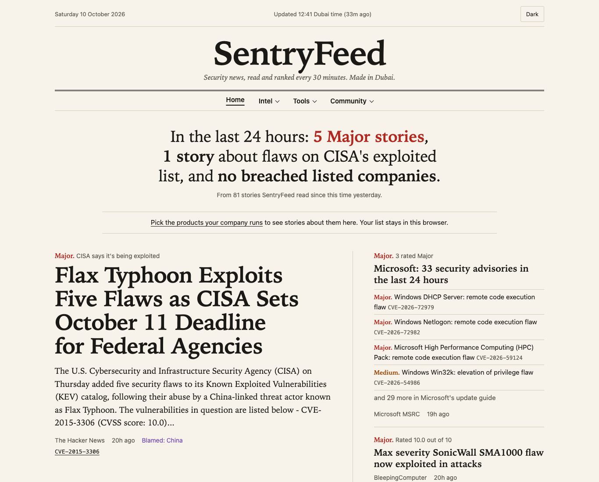

# SentryFeed

A self-hosted threat-intel site running on a Raspberry Pi 3B. Every 30 minutes it pulls security and tech news, looks up the CVEs each story mentions, checks whether CISA has confirmed they're being exploited, and colours every story by how much it matters. The front page reads like a newspaper: what matters today in one sentence, the most important stories, then sections for exploited flaws, the Gulf, markets and the week.



| Colour | Meaning |
|---|---|
| Red | Confirmed exploitation, a zero-day, or CVSS 9.0+ |
| Orange | CVSS 7.0 to 8.9, or a serious incident (breach, ransomware, takeover) |
| Yellow | Everything else that happened |
| Green | Tech and AI news, not an incident |
| Blue | Events: webinars, virtual events, guides and similar posts. Kept because they can be worth reading, but never counted as incidents. The tile only appears when there is at least one |

The same story from several outlets is shown once, with the other outlets listed under it.

## Front page

`/` answers "what matters right now?" in a few seconds. The full list of stories is at `/feed`, with a reading panel, severity filters and windows of 24 hours to 14 days (old links like `/?days=3` redirect there).

- **The day in one sentence:** Major stories, stories about flaws on CISA's exploited list, and breached listed companies, all in the last 24 hours.
- **Top stories:** the five most important from the last 24 hours, ranked by severity, then CISA listing, then how many outlets covered them. The first leads with its summary. Microsoft publishes one advisory per flaw, often dozens a day, so they're grouped into a single item ("Microsoft: 33 security advisories in the last 24 hours") with the most serious listed.
- **Your stack:** if you've picked products on `/stack`, a strip shows recent stories about them. The list stays in your browser, as on the My stack page.
- **Being exploited now:** the week's stories about flaws on CISA's list, or that say a flaw is already being used.
- **In the Gulf:** stories from the regional sources and any story naming a GCC country, with a map of the Gulf. The regional feeds carry a lot of vendor announcements, so their stories only appear when they're serious or about an incident, a flaw or the authorities, and the section says how many it left out.
- **Markets**, **Where it happened** (a small map leading to `/map`), **Coming up** (approved events) and the planned weekly digest.

Severity reasons are written in plain words across the site: "Remote code execution" rather than `mentions 'rce'`, "Rated 9.8 out of 10" rather than `CVSS 9.8`. `score.py` keeps its exact wording for debugging the rules; `briefing.py` translates it for readers and turns Microsoft's titles ("CVE-2026-72979 Windows DHCP Server Remote Code Execution Vulnerability") into "Windows DHCP Server: remote code execution flaw".

## How it works

```
RSS feeds ──> collect.py ──> SQLite ──> Flask dashboard ──> browser
               │
               ├─ fetch.py    download and normalise 12 feeds
               ├─ enrich.py   pull CVE IDs, look up CVSS and CISA KEV status in NVD
               └─ score.py    assign a colour and record why

app.py ──> dedupe.py   group the same story from different outlets
       ├─> geo.py      find the countries each story is about, for the map
       └─> briefing.py the front page and map page, and the plain wording

collect.py ──> stocks.py   breached US-listed companies: SEC filings and share prices
           ├──> vulns.py    CISA's exploited list and EPSS scores, once a day
           └──> ransomware.py  ransomware leak-site claims, counted, once a day
```

- **Sources:** The Hacker News, BleepingComputer, Dark Reading, Krebs on Security, Schneier on Security, Microsoft MSRC, TechCrunch, The Verge (AI), MIT Technology Review, and three Gulf sources: The National (technology), Tahawultech and Security Middle East. The list lives in `feeds.py`.
- **Gulf sources are filtered.** They mix cybersecurity with general tech, vendor and physical-security news (locks, CCTV), so feeds marked `cyber-only` keep only items whose title, summary or tags look like cybersecurity. Plain "security" isn't enough to pass. Gulf News, Khaleej Times and Arab News only offer general news feeds (around 200 items a day), so they aren't used.
- **Storage:** one SQLite file. Links are unique, so re-running the collector never creates duplicates. Only the last 14 days are kept per run, and each source is capped at 100 items (MSRC publishes its whole history in one feed).
- **CVE lookups:** each CVE is looked up in the NVD API once and cached. Unscored CVEs are rechecked after 24 hours, since NVD often scores new CVEs a few days after publication.

## Gulf Cyber Pulse

`/gulf` brings together cyber incidents in the six GCC countries, and says when it started tracking (late September 2026) and that the news side is thin for now:

- **Country by country:** for the UAE, Saudi Arabia, Qatar, Kuwait, Bahrain and Oman, how many security stories named it as where an incident happened, how many ransomware claims named it, and the sector hit and gang seen most.
- **Month by month:** ransomware claims naming a GCC country over the last 12 months (chart with keyboard readouts and a table), and Gulf security stories per month since tracking began.
- **Sectors hit** and **gangs active in the Gulf**, from those claims; **who's blamed** for attacks on the Gulf, from the news (what the reporting says, not proven attribution); and the **latest Gulf stories**.

The news side uses the front page's Gulf filter (the regional outlets, or any story naming a GCC country, without vendor announcements). The claims come from Ransomware.live (credited); to show sectors and gangs per country, `ransomware.py` also counts GCC claims by country and sector together and by country and gang, still counts only, and re-counts older months once when that changes.

## Ransomware claims

`/ransomware` counts the attacks ransomware gangs claim on their leak sites: claims per month for the last 12 months, this month so far against last month, the top countries, sectors and gangs, and the GCC on its own. **No victim is named.** The page says plainly that these are claims, not confirmed attacks: gangs exaggerate, repost or invent victims, and victims who pay quickly never appear.

The numbers come from [Ransomware.live](https://www.ransomware.live), under its terms for non-commercial use: it's credited ("Source: Ransomware.live", linked) on the page; `ransomware.py` asks once a day, as a collector step, never on a visitor's request; each month's list is counted straight away and only the counts are stored (by month, country, sector and gang), so victim names are never saved; and the counts appear only on that page, never in `/api/items` or the RSS feeds, since the terms forbid re-serving the data as an API or feed. Using it in a paid product or service would need Ransomware.live's written permission.

With a free API PRO key from my.ransomware.live in `.ransomware_key` (never committed), it uses api-pro. Without one it falls back to the older keyless API, which allows one request a minute, so it counts one month per run and the past year fills in over a few hours. Run `python ransomware.py` to count now.

## Patch this first

`/patch` is a ranked to-do list: the flaws most worth fixing this week. It takes every CVE in the last 7 days of security news, plus every flaw CISA added in the last 30 days or whose deadline is still ahead, and gives each one points, shown next to it so the order can always be checked:

| Signal | Points |
|---|---|
| On CISA's exploited list | 40 |
| Used by ransomware, says CISA | 10 |
| EPSS: chance of being used in the next 30 days | up to 30 (30 × the chance) |
| CVSS: rated 7 or more out of 10 | up to 10 (7.0 scores 3, 9.8 scores 10) |
| News: each article this week | 2 each, up to 10 |
| CISA's deadline within 7 days | 5 |

Being exploited counts most, because a flaw already used in attacks matters more than a worse one nobody is using. Each entry also says whether NVD's record links to a patch or a vendor advisory (the collector fills in NVD details for recent news CVEs and new CISA additions). The top 25 are kept, 10 shown at first. Flaws about products in My stack are marked, and "Your stack first" moves them to the top, all in the browser. The list has its own feed, `/feeds/patch.xml`, with one item per CVE so a flaw moving up or down isn't repeated.

## Vendor track record

`/vendors` lists every vendor on CISA's exploited list since it began in November 2021, with how many of its flaws are on it, how many were added this year, how many CISA links to ransomware, and its most repeated product; search it, or show only vendors in My stack (matched in the browser). Each vendor has a page (`/vendors/fortinet`) with:

- **Exploited flaws by the year they were disclosed** (the year in the CVE ID), as a chart with keyboard readouts and a table. Counting by the year CISA added them would mislead: it began with 287 older flaws on one day and kept adding older ones in bulk through 2022.
- **Products exploited more than once**, with when each was first and last listed.
- **Disclosure to CISA's list:** the median days from NVD's publication date to CISA listing the flaw, and how many were listed within 30 days. It leaves out the launch-day batch, and is shown only once at least 5 of the vendor's flaws have a publication date; the collector fills these in from NVD, about 100 a run. CISA often lists a flaw after attacks have begun, so it's an upper limit.
- **The latest additions** (linked to their CVE pages) and **this fortnight's news** naming the vendor.

**It's labelled a track record, not a security rating**, on both pages, and there's no single score: vendors with more products and customers draw more attackers and scrutiny, so a bigger count isn't a worse grade. Vendors are named as CISA names them, so Pulse Secure and Ivanti appear separately.

## Weekly digest

`/digest` opens the latest finished week; each week has its own page, like `/digest/2026-W41`, with links to the weeks before and after and an archive of every week. Weeks run Monday to Sunday, Dubai time. Each one has:

- **The week in one sentence:** Major stories, flaws added to CISA's list, breached listed companies and the busiest country (or countries, if they tie).
- **The week in numbers**, compared with the week before: Major and Medium stories, stories about flaws on CISA's list, flaws CISA added, countries named in incidents, and breached listed companies.
- **The biggest stories** (eight, with Microsoft's advisories grouped into one), **new on CISA's list**, **where it happened** (map and busiest countries), **markets**, **the Gulf** and **events listed for the week after**.

Comparisons only appear between two complete weeks: not for the week in progress, and not against SentryFeed's first week, which started part-way through. The page says when that's why they're missing. Past weeks are read from the stories already stored (nothing is deleted), so the archive goes back to the first collector run.

## RSS feeds

`/feeds` lists feeds for following SentryFeed from a feed reader, Outlook or Slack's RSS app (`/feed subscribe <link>`), each covering the last 7 days and updated with every collector run:

| Feed | What's in it |
|---|---|
| `/feeds/major.xml` | Major stories |
| `/feeds/major-medium.xml` | Major and Medium stories |
| `/feeds/gulf.xml` | The Gulf, as on the front page: regional outlets and stories naming a GCC country, without vendor announcements |
| `/feeds/events.xml` | Approved upcoming events |
| `/feeds/patch.xml` | Patch this first: the ranked list, with each flaw's points |
| `/feeds/stack.xml?stack=fortinet,exchange` | Stories about the products in the link, as on My stack |

Each item has the readable headline, the plain-word reason, the summary, the other outlets and the CVEs, and links to the article. An item's ID is the story's first stored article, so it doesn't reappear when more outlets cover the same story. Feeds are RSS 2.0, built with ElementTree so feed text is always escaped, and every page advertises the Major feeds for readers that look for them.

**The stack feed is the one place a product list leaves the browser.** It has to be in the link, because a feed reader fetches the feed without the browser. The `/feeds` page builds the link from the products saved on My stack and says plainly that SentryFeed's server sees the list on every check, as does anyone the link is shared with. The Pi's gunicorn keeps no access log, so it isn't recorded; a host that logs requests (Vercel does) would record it, and this note should change with the move.

## Vulnerabilities

`/vulns` answers three questions about a flaw, each from its own source:

| Question | Source | In plain words |
|---|---|---|
| How bad would it be? | CVSS, from the NVD | "Rated 9.8 out of 10" |
| How likely is it to be used? | [EPSS](https://www.first.org/epss/) by FIRST | "About a 1% chance of being exploited in the next 30 days, higher than 61% of all scored flaws" |
| Is it already being used? | CISA's [Known Exploited Vulnerabilities](https://www.cisa.gov/known-exploited-vulnerabilities-catalog) catalogue | "Yes: due tomorrow for US government agencies" |

- **Look up a CVE:** any CVE ID gets its own page (`/vulns/CVE-2026-72979`) with all three answers, NVD's description, links to patches and vendor advisories, what CISA says to do, and the SentryFeed stories that mention it. CVE IDs anywhere on the site link there.
- **Newly exploited:** everything CISA added in the last 30 days, newest first, with the deadline, ransomware use and EPSS, filterable by vendor, ransomware and My stack. The deadlines bind US government agencies; the page says so, and they're a good benchmark for anyone.
- **In this week's news, most likely to be used:** the CVEs in the last 7 days of security stories, ranked by EPSS, with KEV ones marked.

`vulns.py` runs as a collector step once a day: it downloads CISA's catalogue (about 1.8 MB), fetches EPSS scores for the catalogue and recent news CVEs (100 per request), and fills in NVD descriptions for recent additions. The catalogue also feeds the scoring: a story mentioning a flaw on CISA's list goes red in the same run, without waiting for NVD to catch up. Run `python vulns.py` to refresh now.

A CVE nobody has asked about is looked up live, from NVD and FIRST, and saved. Only the CVE ID is sent; the visitor's address never leaves the Pi. Live lookups are capped at 30 per visitor per hour and 500 a day in total (counted with the same keyed hash of the IP as event submissions, never the IP itself), so a crawler can't run up the NVD key's quota.

This product uses the NVD API but is not endorsed or certified by the NVD.

## Password check

`/password` tells you whether a password has appeared in a data breach, using [Have I Been Pwned's Pwned Passwords](https://haveibeenpwned.com/Passwords), without the password leaving the browser:

1. The browser hashes the password with SHA-1.
2. Only the first 5 of the hash's 40 characters go to SentryFeed, which relays them to Pwned Passwords and gets back every leaked hash starting with them (a few hundred, padded with fake entries so the response size gives nothing away).
3. The browser looks for its own full hash in that list.

SentryFeed relays the request instead of the browser calling Pwned Passwords directly, so visitors' IP addresses never reach HIBP and the page's security policy can forbid connections to any other site. Browsers only provide built-in hashing on HTTPS pages, so `templates/_sha1.js` is a small fallback for the Pi's plain-HTTP setup, tested against Node's SHA-1 on 5,000+ inputs.

## Email header analyser

`/headers` reads an email's raw headers (Gmail's "Show original", Outlook's message source) **entirely in the browser**: nothing is uploaded, and the security policy wouldn't let the page send it anywhere if it tried. It shows:

- **Did it pass?** SPF, DKIM and DMARC from the topmost Authentication-Results header (the one your own mail server added; lower ones can be written by the sender), or Received-SPF. Both the usual layout and Microsoft's are understood.
- **Warnings**, most serious first: DMARC failed, a display name that is itself a different address, replies going to another domain, SPF or DKIM failures, a different envelope sender or signing domain, and hops that didn't record encryption.
- **Who sent it:** From, Reply-To, Return-Path, To, subject, date, Message-ID, and the sending server's IP as your server saw it, with links to check it on AbuseIPDB, VirusTotal and Shodan.
- **The route**, oldest hop first, with the delay between hops, whether each was encrypted, and which addresses are on a private network; then the DKIM signatures and every header.

It says plainly that passing checks doesn't make an email safe, only shows which domain really sent it. Two made-up examples ("a normal email", "a suspicious one") use reserved example domains and documentation-only IP addresses, so it can be tried without real mail. Pasted text is only ever shown with `textContent`.

## File & link check

`/scan` builds links to [VirusTotal](https://www.virustotal.com) reports, with second opinions where they apply:

- **Files** are fingerprinted (SHA-256) in the browser and never uploaded. Hashing streams the file in 4 MB chunks through `templates/_sha256.js`, so any size works without loading it all into memory; it's tested against Node's SHA-256 on 3,000+ inputs with random chunk splits.
- **Links, domains, IPs and hashes** are recognised and sent to the matching report page. Anything that isn't `http` or `https` (such as `javascript:` or `file:`) is rejected.
- **Second opinions**, each only for what it covers: [AbuseIPDB](https://www.abuseipdb.com) (has this IP been reported for abuse?) and [Shodan](https://www.shodan.io) (what does it expose to the internet?) for IP addresses; [URLhaus](https://urlhaus.abuse.ch) (is it spreading malware?) for links and domains; Shodan's DNS records for domains. Hashes go to VirusTotal only. Like VirusTotal, these are plain links: the lookup happens on each service's site, which can see what was searched for, and some ask visitors to confirm they're not a robot first.

SentryFeed never calls the VirusTotal API itself: the free API is limited to 4 lookups a minute and can't be used in commercial products, while linking to VirusTotal's own pages has neither limit. The page warns that VirusTotal adds anything looked up through its website to its dataset, and that uploaded files are shared with its community.

## Scoring rules

Signals are trusted in this order:

1. **CISA KEV.** If NVD says CISA has added the CVE to its Known Exploited Vulnerabilities catalog, the story is red. This is the strongest signal available.
2. **CVSS.** 9.0+ red, 7.0 to 8.9 orange, below 7 yellow. Exploitation language ("exploited in the wild", "zero-day") still lifts a scored item to red, because a medium bug under active attack matters more than its score.
3. **Keywords.** Used only when there's no score. The lists are at the top of `score.py`.

**Events** are spotted by their titles (`[Virtual Event] ...`, `Webinar: ...`, Schneier's Friday squid post) and turn blue before any other rule runs, so a webinar called "Defending against zero-days" isn't counted as a zero-day.

**Roundups and caps.** A few kinds of post would otherwise flood red:

- Weekly roundups ("⚡ Weekly Recap", "ThreatsDay", "The Week in Ransomware") mention every serious story of the week, so they stay yellow.
- Microsoft's feed re-lists every Chrome fix for Edge, a dozen at a time, scored 8.8 to 9.6. Without signs of exploitation they're capped at orange; Google's wording for a Chrome zero-day ("an exploit for CVE-… exists in the wild") still makes them red.
- Pwn2Own "zero-days" are found at a hacking contest and handed straight to vendors, so they're capped at orange.

CISA's exploited list always wins over a cap.

**Negation.** A keyword doesn't count when it's being denied: "not a zero-day", "hasn't been exploited in the wild" and "no evidence it has been exploited in the wild" don't turn red. Only short filler words may sit between the negation and the keyword, so "Microsoft has not patched a zero-day" still does.

Every item stores the reason for its colour (`CVSS 9.8`, `CISA: actively exploited`, `mentions 'zero-day'`), and the dashboard shows it. Everything is rescored on every run, so a score that arrives later or a keyword change applies to old items too.

## Map

`/map` shows where incidents happened and who the reporting blames. It opens on the last 7 days, with a switch for 24 hours to 14 days, and a World/Gulf switch that glides the map to the Gulf. You can zoom in up to 8 times (the + and − buttons, a trackpad pinch, Ctrl and scroll, or two fingers on a phone) and then drag the map around; a plain scroll still scrolls the page, and a drag never counts as picking a country. With the map focused, + and − zoom, the arrow keys move it, and 0 shows the whole world.

- **Where it happened:** the country is filled in the colour of its most serious story, brighter the more stories it has.
- **Blamed:** a purple outline, or purple hatching for a country that was only blamed. A country counts as blamed when it's attached to attacker wording ("Chinese hackers", "Russia-linked group", "backed by Iran") or when a story names a group publicly tied to it (Lazarus → North Korea, Volt Typhoon → China, APT28 → Russia; any Microsoft "Typhoon", "Blizzard", "Sandstorm" or "Sleet" group). Every other country mentioned counts as where it happened.
- **Blamed → targeted:** when one story has both, a curved line with an arrow joins them.

Under the map, a list of every country on it (with its story count and how often it was blamed) filters the stories when you pick one; clicking a country on the map does the same, and the list works by keyboard. The story list starts with the six most important, with a button to show the rest, so the stories that named no country (listed below it, most important first) are easy to reach; the page says how many there are. Each story in the feed shows its countries with a link to the map.

`geo.py` reads only the title and the first two sentences of the summary, because later sentences tend to mention countries in passing (where a researcher is based, older incidents). Matching is case-sensitive, so "US" isn't "us" and "Polish" isn't "polish". Tech news and events aren't mapped, and the page says how many stories named no country. Run `python geo.py` to print what it finds in your database, including the words that made each country blamed. A few phrases are skipped as places: a CISA warning names the US but isn't a US incident, and Pwn2Own Ireland is a contest, not an attack.

The map is drawn from [Natural Earth](https://www.naturalearthdata.com) data (public domain). `tools/build_world.mjs` turns it into a static SVG once, offline, so the Pi loads nothing from other sites. The front page's small map uses a lighter copy with whole-number coordinates, and its Gulf map only the countries around the Gulf. Countries too small for the light 1:110m outlines, like Singapore and Bahrain, appear as dots when a story mentions them.

## Stock impact

`/stocks` follows listed companies named as breach victims over the last 90 days, on four markets:

| Market | Companies | Prices | Compared with | Official breach disclosure |
|---|---|---|---|---|
| US (NYSE, Nasdaq, OTC) | every SEC-registered company | Alpha Vantage | S&P 500 (SPY) | SEC 8-K Item 1.05, checked and linked |
| London (LSE) | ~50 hand-picked: the biggest and most-breached names | Alpha Vantage (`.LON`, in pence) | FTSE 100 (ISF fund) | RNS announcements (not checked) |
| Dubai (DFM) | ~20 hand-picked large companies | none free: card without a chart | – | link to DFM disclosures |
| Abu Dhabi (ADX) | ~25 hand-picked large companies | none free: card without a chart | – | link to ADX disclosures |

London, Dubai and Abu Dhabi names are checked first, so a UK company with US-traded shares (BP, HSBC, Vodafone) is shown against its home market. They don't need an SEC contact.

**Why Dubai and Abu Dhabi have no charts:** no free source covers them. Alpha Vantage doesn't; Twelve Data only on paid plans; TradingView and Investing.com have no public API and their terms forbid automated collection; ADX's terms forbid scraping its site; and DFM only offers manual downloads. ADX launched an official data service in August 2026 with a free tier (100 lookups a month), the most promising way to add ADX prices once its licence is checked. UAE rules require listed companies to announce *material* events, but unlike the SEC there's no rule naming cyber incidents, so a breach may never be announced.

For the US:

- **The share price around the story,** as a chart starting at the last close before the story (0%), next to the S&P 500 over the same days. The headline number is the change since the story, plus how far ahead of or behind the market it is. Prices move for many reasons, so the page shows what happened around the story, never that the breach caused it.
- **The company's own breach filing.** Since December 2023, US-listed companies must file an 8-K under Item 1.05 within four business days of deciding a cyber incident is material. If one was filed within 30 days before or 60 days after the story, the card links straight to it on the SEC's site.

**Spotting the victim.** Company names come from the SEC's list of every US-listed company, shortened from legal names ("CLOROX CO /DE/" → "Clorox"), plus brands headlines use instead ("Ticketmaster" → Live Nation, "Change Healthcare" → UnitedHealth). A company only counts when the headline names it as the victim: "AT&T confirms data breach" and "Hackers breach Snowflake customers" count, but "Cisco patches critical flaw" and "Hackers abuse Microsoft Teams" don't, since there the company makes the product rather than suffering the breach. Several stories about the same company within 72 hours are one incident.

**Security vendor watch.** The same page follows eight big cybersecurity companies (CrowdStrike, Palo Alto Networks, Fortinet, Zscaler, Cloudflare, Okta, SentinelOne, Check Point) and a sector fund (CIBR) over the last 30 trading days, against the S&P 500 and all on one scale. A dot marks each day SentryFeed had a Major or Medium story about a flaw or breach in that company's own products, matched by product name too, so "FortiMail zero-day" counts for Fortinet. This is the case the breach cards leave out: the vendor wasn't hacked, but what it sells was. Stories where the vendor is only the researcher ("Check Point Research finds…") or its brand is faked ("fake Cloudflare checks") don't count. The list is `WATCHLIST` at the top of `stocks.py`.

**Data and limits.** The collector checks each company's SEC filings and Alpha Vantage prices at most once a day: the S&P 500 first, then breach victims (newest story first), then the vendor watch, which takes 10 lookups. It stops at 20 price lookups a day (the free key allows 25), and for the rest of the day if Alpha Vantage says the limit is reached. `python stocks.py` runs an update by hand and prints every incident and the vendor watch.

## My stack

`/stack` lets an IT team tick the products their company runs (about 60, from FortiGate and NetScaler to Exchange, VMware, MOVEit and WordPress) and see only the stories about them from the last 14 days. The feed gets a "My stack" button that filters to the same stories, and it combines with the severity tiles.

**The choices never leave the browser.** They're kept in the browser's local storage. The server only tags each story with the products it mentions (`stack.py`), and the page does the filtering, so SentryFeed never learns what anyone runs. That matters, because a list of a company's products is exactly what an attacker would want.

Matching is case-sensitive on product names, nicknames and parts ("CitrixBleed" is NetScaler, "PAN-OS" is Palo Alto, "Atlassian flaw" counts for Confluence and Jira). Faked brands ("fake Cloudflare checks") and research teams ("Cisco Talos finds…") don't count, and tech news and events aren't tagged. Run `python stack.py` to see which stories match which products.

## Events

`/events` lists cybersecurity events (CTFs, webinars, conferences, meetups, workshops) submitted through `/events/submit` by the people running them. Events starting in the next two weeks also appear under the feed's blue Events tile.

**Nothing goes live until it's approved on the Pi's command line.** There's deliberately no admin page yet, so there's no login to attack:

```bash
python events.py pending           # what's waiting, with the submitter's optional contact email
python events.py approve 4 5       # or: reject 4, remove 4 (take down an approved event), list
```

**Spam and abuse protection:**
- The form carries a signed, timed token (from a random key in `.flask_secret`, made on first run and never committed). Forged tokens and forms left open for over two hours are refused.
- A hidden field that people never see, plus a minimum fill-in time of 3 seconds. Bots that trip either get the normal "thanks" page, and nothing is saved.
- Each visitor can submit 3 events a day, tracked by a keyed hash of their IP so the IP itself isn't stored. The form stops taking submissions while 50 are waiting.
- Every field is cleaned server-side: control and right-to-left override characters are removed, lengths are capped, links must be http(s) without embedded credentials, and the review command never prints raw submitted text to the terminal. Pages escape everything, as with feed content.
- The contact email is optional and only appears in `python events.py pending`, never on the site.

Times are entered in the submitter's own time zone (picked up by the browser, Dubai if JavaScript is off), stored in UTC, and shown in each visitor's own time zone.

**Why CTFs aren't imported automatically:** CTFtime's API is "provided for data analysis and mobile applications only" and can't be used to run CTFtime clones, so the Events page links to CTFtime's calendar instead of copying it.

## Merging duplicate stories

`dedupe.py` groups articles from different outlets that cover the same story. Two articles match when they come from different sources, were published within 72 hours of each other, and either mention the same CVE or have similar titles.

Title similarity weights each word by how rare it is across everything in the window, so sharing "Kiteworks" counts for far more than sharing "flaw" or "attack". The threshold (0.35) was set on ~65 real headlines: the true pairs scored 0.37 to 0.72 and the closest unrelated pair 0.32. Each article is only compared with the first article of each group, so one loose match can't chain unrelated stories together, and an event post is never merged with news about the same topic.

The highest-ranked article leads, so the story takes its colour; the tiles count stories, not articles; and the CVEs of every article in the group are shown. Run `python dedupe.py` to print the groups it would make from your database.

## Design decisions

- **CISA's RSS feeds were discontinued.** KEV status comes from two places: the `cisaExploitAdd` field in NVD's CVE records (the same API call that returns the score), and CISA's own catalogue, downloaded daily, which is often days ahead of NVD.
- **Feed content is treated as untrusted input.** Jinja escapes everything in the list, the detail panel only writes text with `textContent`, and any link that isn't `http` or `https` is dropped, so a compromised feed can't inject script or a `javascript:` link. Tested with a planted `<script>` headline.
- **The Pi 3B has 1 GB of RAM**, so there is no framework beyond Flask, no JavaScript build step, and the collector runs as a one-shot job instead of a resident process.
- **A strict Content Security Policy.** Every page gets a fresh random nonce, and only scripts and styles carrying it may run. Pages may only connect back to this server, so the password page physically can't send anything elsewhere.
- **A glossary where the jargon is.** Terms like KEV, CVSS, EPSS, CVE, zero-day, remote code execution, ransomware and hash have a dotted underline; clicking (or Enter) opens a one-line definition beside them, and Escape or a click elsewhere closes it. The definitions live in one place (`briefing.GLOSSARY`), so every page says the same thing. Without JavaScript they stay plain text, and they're never placed inside links or buttons.
- **Designed like a newspaper.** The front page is a briefing, not a dashboard: serif headlines (system fonts only, since the security policy allows no web fonts), warm paper and ink colours, and severity shown as a coloured word before each headline ("Major.") rather than badges. Light and dark themes both work; the first visit follows the device's setting, a choice is remembered in the browser, and a small script in the page head sets it before anything is drawn, so there's no flash of the wrong theme. Every page shares the same masthead, grouped menus (Intel, Tools, Community; planned pages are named but not linked) and footer.
- **Grouped stories are cached until the collector runs again.** Grouping the same story across outlets takes a few seconds on the Pi, and the stories only change when the collector runs. Each run records when it finished, so the grouped stories are kept until the next run and only the "5m ago" ages are worked out on each visit. (Not the database file's modification time: CVE lookups and event submissions write to it too.)
- **Pages are compressed, except where that could leak a secret.** Gzip shrinks the map pages to about a third. The event form page is left uncompressed: it shows back what a visitor typed next to a form token, which is the setup the BREACH attack uses to guess secrets from response sizes.
- **systemd over cron.** It keeps the dashboard alive, restarts it on failure, starts it on boot, and logs every collector run to the journal. Both units are sandboxed (`ProtectSystem=strict`, `ProtectHome=read-only`, `NoNewPrivileges`) so they can only write inside the project folder.

## Setup

On Raspberry Pi OS Lite (64-bit), as a user named `kaido` (change the paths in `deploy/` if yours differs):

```bash
git clone https://github.com/kaid0x/sentryfeed.git ~/sentryfeed
cd ~/sentryfeed
python3 -m venv venv && source venv/bin/activate
pip install -r requirements.txt

# Optional but recommended: a free NVD API key raises the rate limit 10x
echo 'YOUR-KEY' > .nvd_api_key && chmod 600 .nvd_api_key

# Optional, for the stock impact page:
# the SEC asks automated visitors to identify themselves with a name and email
echo 'SentryFeed you@example.com' > .sec_contact && chmod 600 .sec_contact
# and share prices need a free key from https://www.alphavantage.co/support/#api-key
echo 'YOUR-KEY' > .alphavantage_key && chmod 600 .alphavantage_key

python collect.py          # first run
python app.py              # dashboard on port 5000, Ctrl+C to stop
```

To run it permanently:

```bash
sudo cp deploy/sentryfeed-* /etc/systemd/system/
sudo systemctl daemon-reload
sudo systemctl enable --now sentryfeed-web.service sentryfeed-collect.timer
```

## Known limitations

- Keyword matching only understands simple negation; sarcasm or "could become a zero-day" still matches.
- Story merging compares titles only, so two very differently worded headlines about the same story stay separate.
- Events are spotted by title patterns; one worded like a normal headline lands in yellow, and opinion pieces still do.
- The map reads wording, not meaning: "German police take down a Russian-speaking forum" draws a line from Russia to Germany, and many stories (a Chrome bug, a Microsoft patch) name no country at all.
- "Blamed" is what the reporting says. Attribution is often disputed or later revised.
- Event rate limits use the visitor's IP. Behind a proxy (Vercel, later) every visitor shares the proxy's address, so the real IP has to be read from the proxy's header first.
- Stock impact only spots a victim named in the headline. London, Dubai and Abu Dhabi companies come from hand-picked lists, so smaller companies there aren't recognised. Companies that disclose a breach under Item 8.01 instead of 1.05 (allowed for incidents they don't consider material) don't get the SEC link. Foreign companies that report to the SEC on 20-F and 6-K forms aren't covered by Item 1.05 at all, and their cards say so; tickers traded over the counter (often a foreign company's US shares, like Advantest's ATEYY) are labelled, since they trade less than exchange-listed shares.

## Planned

- Share prices for Dubai and Abu Dhabi companies, through ADX's official data service (free tier) or a paid market-data feed, and permission from DFM.
- An admin page for reviewing event submissions, once there's proper login security (strong passwords, rate-limited sign-in, two-factor). Until then, review stays on the Pi's command line.
- A "check your own password storage" tool for companies: drop in an export of your own user table and the browser reports which hashing method it uses, whether it's salted, and how exposed the accounts would be if it leaked. Like the file check, nothing is uploaded. It must be built so it can't double as a tool for cracking dumps found online, and a fictional sample dump (a separate breach-lab project) would be its demo.
- Later: email breach checks and opt-in alerts via HIBP, with a confirmation link before any email is stored.
